# AGENT.md - AI Bradaa Contributor Guide
# World-Class Development Workflow & Architecture Reference

**Last Updated:** 2025-11-12 02:45 MYT (Asia/Kuala_Lumpur)
**Version:** 2.1
**Status:** Active - Phase 11 Brutal Stack Audit Complete
**Audience:** All AI agents and human developers contributing to AI Bradaa

---

## 🔥 CRITICAL: Phase 11 Brutal Stack Audit Complete

**NEW AUDIT REPORT:** See `PHASE_11_BRUTAL_STACK_AUDIT_2025_11_12.md` for comprehensive infrastructure analysis

**Key Findings (84-Mentor Council):**
- ✅ **Zero-cost stack VALIDATED** - Current architecture is excellent
- 🔥 **4 P0 Blockers identified** - Must fix before deployment:
  1. Add Google Gemini hard spend cap ($50)
  2. Warm Neon database (Netlify cron every 10 min)
  3. Add Upstash Redis for atomic rate limiting
  4. Move eval suite to GitHub Actions (2k min/mo)
- ✅ **Hybrid API Strategy approved** - Flash-Lite + Flash + Kimi K2 + Pro
- ✅ **MYR cost projections** - Free: RM0.04/user, Pro: RM5.32/user, Ultimate: RM106/user

**Composite Score:** 72/100 → 94/100 (after P0 fixes) → Target: ≥99/100

**Deployment Status:** 🔴 BLOCKED until P0 fixes complete

---

## 🎯 Purpose

This guide ensures every contributor (AI agent or human) works safely, consistently, and world-class on the AI Bradaa codebase. It mirrors and syncs with `ULTIMATE_CONSOLIDATED_AUDIT_REPORT.md` as the ultimate source of truth.

---

## 📋 Table of Contents

1. [Quick Start](#quick-start)
2. [Architecture Overview](#architecture-overview)
3. [Core Systems](#core-systems)
4. [Development Workflow](#development-workflow)
5. [Quality Gates](#quality-gates)
6. [Safety Checklist](#safety-checklist)
7. [Code Standards](#code-standards)
8. [Testing Requirements](#testing-requirements)
9. [Deployment Process](#deployment-process)
10. [Common Pitfalls](#common-pitfalls)
11. [Resources](#resources)

---

## 🚀 Quick Start

### Before You Code

**CRITICAL: Read These First**
1. `/ULTIMATE_CONSOLIDATED_AUDIT_REPORT.md` - Architecture source of truth
2. `/CHANGELOG.md` - Development history (Phases 1-11)
3. `/README.md` - Project overview
4. This file (AGENT.md) - Workflow guide

### Environment Setup

```bash
# 1. Clone and navigate
cd /home/user/aibradaa

# 2. Install dependencies
npm install

# 3. Set up environment variables
cp .env.example .env
# Edit .env with required keys (see .env.example for all variables)

# 4. Verify setup
npm run test:smoke

# 5. Start development server
npm run dev
```

### Required Environment Variables

```bash
# Critical (Production-blocking)
GEMINI_API_KEY=required                    # Google AI Studio
GOOGLE_MAPS_API_KEY=required               # Google Cloud Console
JWT_SECRET=required                        # openssl rand -base64 32
PWA_VAPID_PUBLIC_KEY=required             # web-push generate-vapid-keys
PWA_VAPID_PRIVATE_KEY=required

# Gemini 2.5 Models
GEMINI_MODEL_FLASH=gemini-2.5-flash
GEMINI_MODEL_PRO=gemini-2.5-pro
GEMINI_MODEL_PRO_EXP=gemini-2.5-pro-exp

# Data Sync
DATA_SYNC_INTERVAL_MS=21600000             # 6 hours

# Rate Limiting
AI_RATE_LIMIT_FREE=10                      # req/min
AI_RATE_LIMIT_PRO=30
AI_RATE_LIMIT_ULTIMATE=60

# Daily Quotas
AI_QUOTA_FREE=100                          # req/day
AI_QUOTA_PRO=500
AI_QUOTA_ULTIMATE=2000

# Feature Flags
ENABLE_VOICE=true
ENABLE_VISION=true
ENABLE_MAPS=true
ENABLE_SEARCH_GROUNDING=true
ENABLE_THINKING_MODE=true
CATCHPHRASE_ENABLED=true

# Optional
GA4_TRACKING_ID=G-XXXXXXXXXX              # Google Analytics
SENTRY_DSN=                                # Error tracking
```

---

## 🏗 Architecture Overview

### System Architecture (5 Main Systems)

```
AI Bradaa Ecosystem
│
├── 1. Syeddy Orchestrator (Internal - Development Team Use Only)
│   └── Oversees project execution with AI intelligence system
│
├── 2. AI Bradaa (PUBLIC - Main Product)
│   ├── 7 PWA Tools (Matchmaker, Versus, Explorer, Command, Intel, Appendices, Camera Tech)
│   ├── Gemini 2.5 Pro/Flash Integration
│   ├── Voice, Vision, Maps Features
│   └── Three-Tier Pricing (Free RM0, Pro RM30, Ultimate RM80)
│
├── 3. ABO-84 Beta (PUBLIC - Ultimate Tier Only)
│   ├── AI Coding Assistant (like Claude Code, Cursor)
│   ├── Desktop Apps (Windows .exe, macOS .dmg, Linux .AppImage)
│   ├── VS Code Extension
│   ├── CLI Tool (npm install -g abo84-beta)
│   └── Ollama Integration (ollama install aibradaa/abo84-beta)
│
├── 4. AI Pod (Internal - Centralized AI Hub)
│   ├── /ai_pod/personas/ - AI personality systems
│   ├── /ai_pod/pipelines/ - TOON format, data processing
│   ├── /ai_pod/adapters/ - Gemini adapters
│   ├── /ai_pod/services/ - Catchphrase engine, RAG, etc.
│   └── /ai_pod/prototypes/ - Experimental features (soul_v1, deck_v2, thinking_v1)
│
└── 5. Syeddy Debugger (Internal - Owner Maintenance Only)
    ├── 300+ Signal Monitoring
    ├── Safe-Diff Patcher
    └── 1-Click Update System
```

### Directory Structure (Source of Truth)

```
/home/user/aibradaa/
├── /public/                  # Frontend (Deployed)
│   ├── /app/                # 7 PWA tools (deployed versions)
│   ├── /scripts/            # Core JS (app-core.js, ai-integration.js, etc.)
│   ├── /icons/              # PWA icons (8 sizes)
│   ├── /data/               # Frontend laptop data (217KB subset)
│   ├── index.html           # Landing page
│   ├── app.html             # Main PWA
│   └── manifest.json        # PWA manifest
│
├── /netlify/functions/      # Backend (Serverless)
│   ├── command.mjs, chat.mjs, intel.mjs, deck.mjs
│   ├── gemini-live.mjs, vision-analysis.mjs
│   ├── stripe-webhook.mjs, auth.mjs
│   └── /utils/              # Shared utilities (gemini.mjs, quota.mjs, cache.mjs)
│
├── /ai_pod/                 # AI Centralization Hub (Internal)
│   ├── /personas/           # AI personalities (syeddy_base_v2.3.0, command_*, catchphrases)
│   ├── /pipelines/          # TOON format, data processing
│   ├── /adapters/           # Gemini v2.5 adapter
│   ├── /services/           # Auto-fetch, RAG, deep-research
│   └── /prototypes/         # Experimental (soul_v1, deck_v2, thinking_v1, branding_v1)
│
├── /data/                   # Master Data (Source of Truth)
│   ├── laptops.json         # Master laptop database (348KB, 100 laptops)
│   └── quarantine/          # Invalid data
│
├── /database/               # PostgreSQL Schema
│   ├── /schema/             # SQL schemas
│   ├── /migrations/         # Database migrations
│   └── /repositories/       # Data access layer
│
├── /project/governance/84/  # Internal Governance (Development Team)
│   ├── council_roster.json  # AI intelligence system profiles (193KB)
│   ├── composite_score_nov_2025.md
│   ├── policy_pdpa.md, policy_security.md
│   └── /eval_suites/        # Evaluation baselines
│
├── /abo-84-beta/            # ABO-84 Coding Assistant
│   ├── /demo/               # Demo files
│   └── README.md            # Distribution guide
│
├── /syeddy-debugger/        # Owner Debugger (Internal)
│   └── /signals/            # 300+ monitoring signals
│
├── /tests/                  # Test Suites
│   ├── /smoke/              # Smoke tests
│   ├── /integration/        # Integration tests
│   ├── /unit/               # Unit tests
│   └── /data/               # Data validation
│
├── /tools/                  # Build & Dev Tools
│   ├── build.mjs, dev-server.mjs
│   └── /etl/                # Data extraction/transformation
│
├── /internal/               # Internal Documentation
│   └── /one-piece-reference/ # Tone guide (INTERNAL USE ONLY)
│
├── /archive/                # Deprecated Code (DO NOT USE)
│   ├── /api/                # Deprecated Express API (use /netlify/functions/)
│   ├── /documentation_2025-11-09/
│   └── /audit_reports_2025_11_09/
│
├── ULTIMATE_CONSOLIDATED_AUDIT_REPORT.md  # Architecture Source of Truth
├── CHANGELOG.md             # Development history (Phases 1-11)
├── README.md                # Project overview
├── AGENT.md                 # This file
├── package.json             # Dependencies & scripts
├── netlify.toml             # Netlify deployment config
└── .env.example             # Environment template
```

---

## 🧩 Core Systems

### System 1: Syeddy Orchestrator (Internal Use Only)

**Purpose:** Development team's AI intelligence system for project execution
**Location:** `/project/governance/84/`
**Public Exposure:** ❌ NONE - Keep internal

**Key Concepts:**
- AI-powered decision intelligence
- Composite scoring system (target: ≥99/100)
- Automated quality gates
- Never mention in public-facing code or documentation

**Internal Files:**
- `/project/governance/84/council_roster.json` - AI intelligence profiles (193KB)
- `/project/governance/84/composite_score_nov_2025.md` - Current quality score
- `/project/governance/84/lenses_catalog.json` - Decision analysis lenses
- `/project/governance/84/policy_pdpa.md` - PDPA compliance policy
- `/project/governance/84/policy_security.md` - Security policy

**Public Terminology:**
- Instead of "84-mentor council" → Use "AI Bradaa Intelligence System"
- Instead of mentor names → Use "AI Bradaa [Domain]" (e.g., "AI Bradaa Strategy")

---

### System 2: AI Bradaa (Main Public Product)

**Purpose:** Malaysia's first AI-powered laptop recommendation platform
**Location:** `/public/`
**Public Exposure:** ✅ FULL - Main product

**7 PWA Tools:**

1. **Matchmaker** - 5 questions → 3 perfect laptop matches
2. **Versus Mode** - Compare 2-3 laptops with radar charts
3. **Explorer** - Browse Top 35 with smart filters
4. **AI Bradaa Command** - Natural language chat interface
5. **Intel Feed** - News, reviews, price drops
6. **Appendices** - Full Top-100 catalog with affiliate links
7. **Camera Tech** - Webcam specs for creators (Coming Q2 2025)

**Key Features:**
- Gemini 2.5 Pro/Flash AI integration
- Voice interface (Gemini Live API)
- Vision analysis (upload laptop photos)
- Google Maps integration (store locations)
- Offline-first PWA
- Push notifications
- Three-tier pricing (Free RM0, Pro RM30, Ultimate RM80)

**Tech Stack:**
- Frontend: Vanilla JS (ESM), HTML5, CSS3
- PWA: Service Worker, IndexedDB, Web App Manifest
- Backend: Netlify Serverless Functions
- AI: Google Gemini 2.5 Pro/Flash
- Maps: Google Maps JavaScript API + Places API
- Analytics: Google Analytics 4 (GDPR compliant)

---

### System 3: ABO-84 Beta (Advanced Coding Assistant)

**Purpose:** AI coding assistant for developers (like Claude Code, Cursor)
**Location:** `/abo-84-beta/`
**Public Exposure:** ✅ PARTIAL - Ultimate tier only (RM80/month)

**Distribution Methods:**

1. **Standalone Desktop App**
   - Windows: `.exe` installer
   - macOS: `.dmg` installer
   - Linux: `.AppImage` or Snap

2. **Ollama Integration**
   ```bash
   ollama install aibradaa/abo84-beta
   ```

3. **VS Code Extension**
   - Available on VS Code Marketplace
   - Integrated editor workflow
   - Inline suggestions + chat panel

4. **CLI Tool**
   ```bash
   npm install -g abo84-beta
   ```

**Access Control:**
- ❌ FREE Tier (RM0) - No access
- ❌ PRO Tier (RM30) - No access
- ✅ ULTIMATE Tier (RM80) - Full access

**Key Features:**
- AI intelligence-backed code reviews
- Real-time coding assistance
- Local LLM execution (privacy-focused via Ollama)
- No cloud dependencies option
- Terminal-based + IDE integration

---

### System 4: AI Pod (Internal AI Centralization Hub)

**Purpose:** Centralized AI logic, features, pipelines (Internal)
**Location:** `/ai_pod/`
**Public Exposure:** ❌ NONE - Internal only

**Sub-Systems:**

1. **Personas** (`/ai_pod/personas/`)
   - `syeddy_base_v2.3.0.md` - Base AI personality
   - `command_fast_v1.2.0.md` - Fast response mode (≤1.2s latency)
   - `command_think_v1.0.0.md` - Deep reasoning mode
   - `one_piece_catchphrase_engine_v4.mjs` - Personality system (INTERNAL reference only)
   - Never expose One Piece references in public files

2. **Pipelines** (`/ai_pod/pipelines/`)
   - TOON format (30-60% token savings vs JSON)
   - Data processing workflows

3. **Adapters** (`/ai_pod/adapters/`)
   - `gemini_v2_5_adapter.mjs` - Gemini API integration

4. **Services** (`/ai_pod/services/`)
   - `catchphrase_auto_fetch.mjs` - Daily catchphrase refresh (3:00 AM MYT)
   - `deep_research.mjs` - Advanced RAG search
   - `rag_search.mjs` - Retrieval-augmented generation

5. **Prototypes** (`/ai_pod/prototypes/`)
   - `soul_v1/` - Ferrofluid state visualization
   - `deck_v2/` - 8-card response format
   - `thinking_v1/` - Typing/shimmer animations
   - `branding_v1/` - Logo, colors, typography

**Critical Rules:**
- ❌ Never import from `/ai_pod` in `/public` files
- ✅ Only `/netlify/functions` can import from `/ai_pod`
- ❌ Never expose internal AI logic to frontend

---

### System 5: Syeddy Debugger (Internal Owner Maintenance)

**Purpose:** Automated maintainer for owner debugging (Internal)
**Location:** `/syeddy-debugger/`
**Public Exposure:** ❌ NONE - Owner only

**Features:**
- 300+ monitoring signals
- Safe-diff patcher
- 1-click update system
- Never mention in public documentation

---

## 🔄 Development Workflow

### Step 1: Planning

**Before writing code:**

1. **Check Existing Implementation**
   ```bash
   # Search for similar features
   grep -r "function_name" /home/user/aibradaa/
   ```

2. **Review Source of Truth**
   - Read `/ULTIMATE_CONSOLIDATED_AUDIT_REPORT.md` section for your feature
   - Check `/CHANGELOG.md` for related Phase implementations
   - Verify in `/project/governance/84/composite_score_nov_2025.md` for quality requirements

3. **Identify Impact Areas**
   - Frontend only? → `/public/`
   - Backend only? → `/netlify/functions/`
   - Full-stack? → Both
   - AI-related? → Must centralize in `/ai_pod/`

4. **Plan Quality Gates**
   - What tests are needed? (smoke/integration/unit)
   - What documentation updates?
   - What composite score impact?

---

### Step 2: Implementation

**Coding Standards:**

1. **File Placement** (CRITICAL)
   - ❌ NEVER create in `/api/` (deprecated, use `/netlify/functions/`)
   - ❌ NEVER create in `/Laptops/` (deprecated, use `/data/laptops.json`)
   - ❌ NEVER create in `/app/` (use `/public/app/` for deployed code)
   - ✅ Frontend: `/public/`
   - ✅ Backend: `/netlify/functions/`
   - ✅ AI Logic: `/ai_pod/`
   - ✅ Tests: `/tests/`
   - ✅ Tools: `/tools/`

2. **Module Pattern**
   ```javascript
   // ✅ Good: ES6 modules
   export function myFunction() { }
   import { helper } from './utils.mjs';

   // ❌ Bad: CommonJS in new code
   module.exports = { };
   const helper = require('./utils');
   ```

3. **Error Handling**
   ```javascript
   // ✅ Good: Try-catch with specific errors
   try {
     const result = await riskyOperation();
     return { success: true, data: result };
   } catch (error) {
     console.error('[FunctionName] Error:', error.message);
     return { success: false, error: error.message };
   }

   // ❌ Bad: Silent failures
   try {
     await riskyOperation();
   } catch (e) { }
   ```

4. **Environment Variables**
   ```javascript
   // ✅ Good: Validate required env vars
   const API_KEY = process.env.GEMINI_API_KEY;
   if (!API_KEY) {
     throw new Error('GEMINI_API_KEY is required');
   }

   // ❌ Bad: Silent undefined
   const API_KEY = process.env.GEMINI_API_KEY;
   await callAPI(API_KEY); // Will fail silently if undefined
   ```

5. **Rate Limiting** (All AI endpoints MUST have)
   ```javascript
   import { checkRateLimit } from '../utils/quota.mjs';

   export async function handler(event) {
     const userId = getUserId(event);
     const tier = await getUserTier(userId);

     const rateLimitCheck = await checkRateLimit(userId, tier, 'ai-endpoint');
     if (!rateLimitCheck.allowed) {
       return {
         statusCode: 429,
         body: JSON.stringify({ error: 'Rate limit exceeded' })
       };
     }

     // ... rest of handler
   }
   ```

---

### Step 3: Testing

**Required Tests (Per Type):**

| Code Type | Required Tests | Location |
|-----------|----------------|----------|
| Netlify Function | Integration test | `/tests/integration/` |
| Public UI | Smoke test | `/tests/smoke/` |
| Utility Function | Unit test | `/tests/unit/` |
| Data Change | Data validation | `/tests/data/` |

**Test Commands:**
```bash
# Run all tests
npm run test:all

# Smoke tests only (boot, CSP, render)
npm run test:smoke

# Data tests (schema, validation)
npm run test:data

# Integration tests (API endpoints)
npm run test:integration

# Unit tests
npm run test:unit
```

**Coverage Target:** ≥70% for production deployment

---

### Step 4: Documentation

**Required Documentation Updates:**

1. **Code Changes:**
   - Add JSDoc comments to all exported functions
   - Update README.md if public-facing feature
   - Update AGENT.md if workflow changes
   - Update ULTIMATE_CONSOLIDATED_AUDIT_REPORT.md if architectural change

2. **Example JSDoc:**
   ```javascript
   /**
    * Fetches laptop recommendations based on user preferences
    * @param {Object} preferences - User preferences
    * @param {string} preferences.budget - Budget range
    * @param {Array<string>} preferences.useCases - Use cases
    * @param {string} preferences.tier - User tier (free/pro/ultimate)
    * @returns {Promise<Object>} Recommendations result
    * @throws {Error} If Gemini API fails
    */
   export async function getRecommendations(preferences) {
     // ...
   }
   ```

3. **CHANGELOG.md Entry:**
   ```markdown
   ## Phase X - Feature Name (YYYY-MM-DD)

   **Commit:** `abc1234`
   **Lines Added/Modified:** XXX lines
   **Composite Score:** XX/100

   ### Implementation Summary
   [Brief description]

   ### Key Deliverables
   1. Feature A
   2. Feature B

   ### Files Created/Enhanced
   - /path/to/file.mjs (XXX lines)
   ```

---

## 🛡 Quality Gates

### Pre-Commit Checklist

**Before committing, verify:**

- [ ] No `console.log()` in production code (use proper logging)
- [ ] No placeholder values (e.g., `G-XXXXXXXXXX`, `YOUR_API_KEY`)
- [ ] No TODO comments in critical paths
- [ ] All imports resolve correctly
- [ ] No syntax errors (`node --check file.mjs`)
- [ ] No One Piece character names in public files
- [ ] No mentor names in public files
- [ ] All secrets in `.env` (not hardcoded)
- [ ] Rate limiting added to AI endpoints
- [ ] Error handling present
- [ ] Tests written and passing

---

### Pre-Deployment Checklist

**Before deploying to production:**

- [ ] All tests pass (`npm run test:all`)
- [ ] Composite score ≥99/100
- [ ] No blocking issues in governance review
- [ ] Environment variables set in Netlify
- [ ] Smoke tests pass on staging
- [ ] No PDPA compliance violations
- [ ] Cost ceiling enforced per tier
- [ ] SLO monitoring instrumented
- [ ] Rollback plan documented

---

## 🚨 Safety Checklist

### Security Red Lines (NEVER violate)

1. **API Keys**
   - ❌ NEVER commit API keys to git
   - ❌ NEVER hardcode secrets in code
   - ✅ ALWAYS use environment variables
   - ✅ ALWAYS validate env vars on startup

2. **User Data**
   - ❌ NEVER log sensitive user data
   - ❌ NEVER store passwords in plaintext
   - ✅ ALWAYS use bcrypt for passwords
   - ✅ ALWAYS encrypt PII at rest

3. **PDPA Compliance**
   - ❌ NEVER collect data without consent
   - ❌ NEVER keep data beyond TTL
   - ✅ ALWAYS honor deletion requests
   - ✅ ALWAYS anonymize analytics

4. **Rate Limiting**
   - ❌ NEVER allow unlimited AI requests
   - ✅ ALWAYS enforce tier quotas
   - ✅ ALWAYS track token usage
   - ✅ ALWAYS cost ceiling enforcement

5. **Input Validation**
   - ❌ NEVER trust user input
   - ✅ ALWAYS sanitize inputs
   - ✅ ALWAYS validate against schema
   - ✅ ALWAYS escape outputs (XSS prevention)

---

### Legal Compliance

**One Piece References (CRITICAL):**
- ❌ NEVER use character names in public files (Luffy, Zoro, Nami, etc.)
- ❌ NEVER use direct quotes from episodes
- ❌ NEVER use trademarked terms (Straw Hat Pirates, etc.)
- ✅ OK in `/internal/one-piece-reference/` (internal use only)
- ✅ OK if 80%+ paraphrased and transformed

**Public Terminology:**
- Instead of "Luffy" → Use "AI Bradaa"
- Instead of "Nakama" → Use "teammate" or "friend"
- Instead of "Pirate King" → Use "champion" or "leader"

---

## 📝 Code Standards

### JavaScript/Node.js

**File Naming:**
- `.mjs` for ES6 modules (server-side)
- `.js` for browser JavaScript
- Use kebab-case for files: `data-sync.js` not `dataSync.js`

**Function Naming:**
```javascript
// ✅ Good: Descriptive, verb-first
async function fetchLaptopRecommendations(preferences) { }
function calculateCompositeScore(metrics) { }

// ❌ Bad: Unclear, noun-first
async function laptops(prefs) { }
function score(m) { }
```

**Async/Await:**
```javascript
// ✅ Good: Async/await with error handling
async function fetchData() {
  try {
    const response = await fetch(url);
    return await response.json();
  } catch (error) {
    console.error('[fetchData] Error:', error);
    throw error;
  }
}

// ❌ Bad: Promise chains
function fetchData() {
  return fetch(url)
    .then(r => r.json())
    .catch(e => console.error(e));
}
```

**Imports:**
```javascript
// ✅ Good: Explicit imports
import { getGeminiClient } from '../utils/gemini.mjs';
import { checkRateLimit } from '../utils/quota.mjs';

// ❌ Bad: Wildcard imports
import * as utils from '../utils.mjs';
```

---

### HTML/CSS

**HTML Structure:**
```html
<!-- ✅ Good: Semantic HTML5 -->
<section id="features">
  <h2>AI Bradaa Features</h2>
  <article class="feature-card">
    <h3>Matchmaker</h3>
    <p>Find your perfect laptop</p>
  </article>
</section>

<!-- ❌ Bad: Div soup -->
<div id="features">
  <div class="title">AI Bradaa Features</div>
  <div class="card">
    <div class="card-title">Matchmaker</div>
    <div>Find your perfect laptop</div>
  </div>
</div>
```

**CSS Classes:**
```css
/* ✅ Good: BEM-style naming */
.feature-card { }
.feature-card__title { }
.feature-card__description { }
.feature-card--highlighted { }

/* ❌ Bad: Generic, unclear */
.card { }
.title { }
.desc { }
```

---

### SQL/Database

**Schema Changes:**
```sql
-- ✅ Good: Migration with rollback
-- Migration 005_add_tier_column.sql
ALTER TABLE users ADD COLUMN tier VARCHAR(20) DEFAULT 'free';
CREATE INDEX idx_users_tier ON users(tier);

-- Rollback:
-- DROP INDEX idx_users_tier;
-- ALTER TABLE users DROP COLUMN tier;

-- ❌ Bad: Direct schema modification without migration
ALTER TABLE users ADD COLUMN tier VARCHAR(20);
```

**Queries:**
```javascript
// ✅ Good: Parameterized queries (SQL injection prevention)
const result = await db.query(
  'SELECT * FROM users WHERE email = $1',
  [email]
);

// ❌ Bad: String concatenation (SQL injection risk!)
const result = await db.query(
  `SELECT * FROM users WHERE email = '${email}'`
);
```

---

## 🧪 Testing Requirements

### Test Coverage by Phase

| Phase | Test Type | Coverage Target | Status |
|-------|-----------|-----------------|--------|
| Pre-Production | Smoke | 100% critical paths | Required |
| Pre-Production | Integration | ≥70% API endpoints | Required |
| Pre-Production | Unit | ≥60% utilities | Recommended |
| Pre-Production | Data | 100% schema | Required |

### Writing Good Tests

**Smoke Test Example:**
```javascript
// tests/smoke/boot.test.mjs
import { test } from 'node:test';
import assert from 'node:assert';

test('Application boots without errors', async () => {
  const { default: app } = await import('../../api/server.mjs');
  assert.ok(app, 'App should export server instance');
});

test('Environment variables are set', () => {
  assert.ok(process.env.GEMINI_API_KEY, 'GEMINI_API_KEY required');
  assert.ok(process.env.JWT_SECRET, 'JWT_SECRET required');
});
```

**Integration Test Example:**
```javascript
// tests/integration/gemini.test.mjs
import { test } from 'node:test';
import assert from 'node:assert';
import { handler } from '../../netlify/functions/chat.mjs';

test('Chat endpoint returns valid response', async () => {
  const event = {
    body: JSON.stringify({ query: 'Best laptop under RM5000?' }),
    headers: { authorization: 'Bearer test-token' }
  };

  const response = await handler(event);
  assert.strictEqual(response.statusCode, 200);

  const body = JSON.parse(response.body);
  assert.ok(body.response, 'Should have response field');
  assert.ok(body.metadata, 'Should have metadata');
});
```

---

## 🚀 Deployment Process

### Deployment Workflow

```mermaid
graph LR
    A[Code Change] --> B[Run Tests]
    B --> C{Tests Pass?}
    C -->|No| A
    C -->|Yes| D[Update Docs]
    D --> E[Composite Score Check]
    E --> F{Score ≥99?}
    F -->|No| A
    F -->|Yes| G[Commit to Branch]
    G --> H[Push to Remote]
    H --> I[Create PR]
    I --> J[Netlify Preview]
    J --> K[Review & Approve]
    K --> L[Merge to Production Branch]
    L --> M[Netlify Production Deploy]
    M --> N[Verify Deployment]
```



### Deployment Commands

**Local Testing:**
```bash
# 1. Run all tests
npm run test:all

# 2. Build for production
npm run build

# 3. Test production build locally
netlify dev
```

**Staging Deployment:**
```bash
# Deploy to Netlify preview
netlify deploy

# Test preview URL
# https://[deploy-id]--aibradaa.netlify.app
```

**Production Deployment:**
```bash
# Deploy to production
netlify deploy --prod

# Verify deployment
curl https://aibradaa.com/api/health
```

**Environment Variables (Netlify Dashboard):**
1. Go to Netlify Dashboard → Site Settings → Environment Variables
2. Add all variables from `.env.example`
3. Restart deployment

---

## ⚠️ Common Pitfalls

### 1. Using Deprecated /api Folder

**Problem:**
```javascript
// ❌ Wrong: Importing from deprecated /api
import { geminiAdapter } from '../../api/adapters/geminiAdapter.mjs';
```

**Solution:**
```javascript
// ✅ Correct: Use /netlify/functions/utils
import { getGeminiClient } from '../utils/gemini.mjs';
```

---

### 2. Forgetting Rate Limits

**Problem:**
```javascript
// ❌ Wrong: No rate limiting
export async function handler(event) {
  const { query } = JSON.parse(event.body);
  const response = await callGeminiAPI(query);
  return { statusCode: 200, body: JSON.stringify(response) };
}
```

**Solution:**
```javascript
// ✅ Correct: Rate limit check
import { checkRateLimit } from '../utils/quota.mjs';

export async function handler(event) {
  const userId = getUserId(event);
  const tier = await getUserTier(userId);

  const rateCheck = await checkRateLimit(userId, tier, 'ai-chat');
  if (!rateCheck.allowed) {
    return { statusCode: 429, body: JSON.stringify({ error: 'Rate limit exceeded' }) };
  }

  const { query } = JSON.parse(event.body);
  const response = await callGeminiAPI(query);
  return { statusCode: 200, body: JSON.stringify(response) };
}
```

---

### 3. Hardcoding API Keys

**Problem:**
```javascript
// ❌ CRITICAL: Hardcoded API key (security risk!)
const GEMINI_API_KEY = 'AIzaSyXXXXXXXXXXXXXXXXXXXXXXXXXXXXX';
```

**Solution:**
```javascript
// ✅ Correct: Environment variable
const GEMINI_API_KEY = process.env.GEMINI_API_KEY;
if (!GEMINI_API_KEY) {
  throw new Error('GEMINI_API_KEY environment variable is required');
}
```

---

### 4. Exposing Internal AI Logic

**Problem:**
```javascript
// ❌ Wrong: Importing from /ai_pod in frontend
import { getGeminiClient } from '../../../ai_pod/adapters/gemini_v2_5_adapter.mjs';
```

**Solution:**
```javascript
// ✅ Correct: Frontend calls backend API, backend imports from /ai_pod
// Frontend (public/scripts/ai-integration.js)
const response = await fetch('/api/chat', {
  method: 'POST',
  body: JSON.stringify({ query })
});

// Backend (netlify/functions/chat.mjs)
import { getGeminiClient } from '../../ai_pod/adapters/gemini_v2_5_adapter.mjs';
```

---

### 5. Forgetting to Update CHANGELOG.md

**Problem:**
You implemented a feature but didn't document it in CHANGELOG.md

**Solution:**
After every significant change, add entry to CHANGELOG.md:
```markdown
## Phase X.Y - Feature Name (2025-MM-DD)

**Commit:** `[commit-hash]`
**Lines Added:** XXX

### Implementation
- Feature A implemented
- Feature B enhanced

### Files Modified
- /path/to/file.mjs (+XXX lines)
```

---

## 📚 Resources

### Documentation Hierarchy (Read in Order)

1. **ULTIMATE_CONSOLIDATED_AUDIT_REPORT.md** - Architecture source of truth (12,825 lines)
2. **CHANGELOG.md** - Development history (Phases 1-11)
3. **AGENT.md** (this file) - Contributor workflow guide
4. **README.md** - Project overview
5. **Phase-specific docs:**
   - `/PHASE-9.20-IMPLEMENTATION-SUMMARY.md` - Semantic routing
   - `/SEMANTIC-ROUTING-QUICKSTART.md` - Auto-routing guide
   - `/INFRASTRUCTURE_SUITE_SUMMARY.md` - Infrastructure overview

### Key Configuration Files

- **/.env.example** - Environment variables template
- **/netlify.toml** - Netlify deployment config
- **/package.json** - Dependencies & scripts
- **/public/manifest.json** - PWA configuration

### Internal Documentation

- **/internal/one-piece-reference/README.md** - Personality tone guide (INTERNAL ONLY)
- **/project/governance/84/policy_pdpa.md** - PDPA compliance
- **/project/governance/84/policy_security.md** - Security policies

### External Resources

- **Gemini API Docs:** https://ai.google.dev/docs
- **Netlify Functions:** https://docs.netlify.com/functions/overview/
- **PWA Docs:** https://web.dev/progressive-web-apps/
- **Google Maps API:** https://developers.google.com/maps/documentation

---

## 📋 7-PHASE IMPLEMENTATION PLAN (Based on November 2025 Repo Audit)

**Last Updated:** 2025-11-12
**Status:** Active Roadmap
**Audit Score:** 6.5/10 (Reality Check - See Comprehensive Codebase Analysis)

This section documents the systematic plan to fix the 10 critical gaps identified in the brutally honest repo audit.

---

### **PHASE 1: Fix Data Pipeline (P0 - CRITICAL)**
**Status:** 🔴 BLOCKED - ETL Returns 0 Items
**Estimated Effort:** 3-5 days
**Assigned To:** Backend Team

**Problem:**
- `/tools/etl/pipeline.mjs` - All fetchers return empty arrays `[]`
- `fetchShopee()` (line 86-88) - PLACEHOLDER
- `fetchLazada()` (line 90-94) - PLACEHOLDER
- `fetchOEM()` (line 97-100) - PLACEHOLDER
- `/ai_pod/services/laptop_auto_fetch.mjs` - Lines 197-232 are stubs

**Impact:** Extended catalog empty, no fresh data, manual curation only

**Fix Checklist:**
- [ ] Implement real Shopee scraper (Playwright/Puppeteer)
- [ ] Implement real Lazada API integration
- [ ] Implement real OEM site scrapers (Dell, HP, Lenovo, ASUS)
- [ ] Add retry logic with exponential backoff
- [ ] Add validation against schema before ingestion
- [ ] Test with real runs (fetch >0 laptops)
- [ ] Schedule weekly ETL via cron (Netlify Scheduled Functions)
- [ ] Update `/data/laptops-extended.json` (currently 0 items)

**Success Criteria:**
- ETL returns ≥50 laptops per run
- Data passes AJV schema validation
- Weekly automated runs successful for 3 consecutive weeks

---

### **PHASE 2: Connect Frontend to Real Data (P0 - CRITICAL)**
**Status:** 🔴 BROKEN - Using Mock/Hardcoded Data
**Estimated Effort:** 2-3 days
**Assigned To:** Frontend Team

**Problem:**
- `explorer-search.mjs` generates 100 mock laptops in-memory (line 27-68)
- `matchmaker-recommend.mjs` uses 8 hardcoded laptops (line 26-115)
- `intel.mjs` returns hardcoded trends (line 24-26)
- Functions ignore `/data/laptops.json` (100 real laptops available!)

**Impact:** Users see fake data, not real Malaysian laptop market

**Fix Checklist:**
- [ ] Update `explorer-search.mjs` to read from `/data/laptops.json`
- [ ] Update `matchmaker-recommend.mjs` to use real database
- [ ] Update `intel.mjs` to fetch real trending topics (web scraping or API)
- [ ] Remove all hardcoded laptop arrays
- [ ] Add database connection to Netlify Functions
- [ ] Verify with end-to-end test (search returns real laptop names)

**Success Criteria:**
- Explorer shows real laptops from database
- Matchmaker recommends from full 100-laptop catalog
- Intel feed shows real market trends (not "RTX 4060", "16GB RAM")

---

### **PHASE 3: Optimize RAG Search (P1 - HIGH)**
**Status:** ⚠️ INEFFICIENT - Computes Embeddings On-The-Fly
**Estimated Effort:** 2 days
**Assigned To:** AI Team

**Problem:**
- `rag-search.mjs` computes embeddings for EVERY search request
- No pre-computed vector database
- Will be slow with 100+ laptops (each search = 100+ Gemini API calls)

**Impact:** High latency, high cost, poor UX

**Fix Checklist:**
- [ ] Pre-compute embeddings for all laptops (batch job)
- [ ] Store embeddings in PostgreSQL (pgvector extension) or JSON cache
- [ ] Update `rag-search.mjs` to use cached embeddings
- [ ] Add incremental update (re-embed only changed laptops)
- [ ] Measure latency before/after (target: <500ms)

**Success Criteria:**
- RAG search completes in <500ms (p95)
- Embedding API calls reduced by 99%
- Cost per search <RM0.01

---

### **PHASE 4: Real Mentor LLM Calls (P1 - HIGH)**
**Status:** ⚠️ SIMULATED - Hardcoded Responses
**Estimated Effort:** 3-4 days
**Assigned To:** AI Governance Team

**Problem:**
- `mentor-consultation.mjs` has real semantic routing
- BUT: Mentor responses are SIMULATED (lines 109-134)
- Uses hardcoded responses, not real LLM calls per mentor persona
- Current `syeddy_orchestrator.mjs` voting is randomized (lines 649-687)

**Impact:** "84-mentor governance" is theater, not real AI decision-making

**Fix Checklist:**
- [ ] Extract all 84 mentor profiles from DOC 1 (thinking styles, lenses, playbooks)
- [ ] Rebuild `_getMentorVote()` in `syeddy_orchestrator.mjs` to use:
  - [ ] Mentor's thinking style
  - [ ] Mentor's top lenses (wont-do, moat, prfaq, etc.)
  - [ ] Mentor's risk appetite (Low/Balanced/Medium-high)
  - [ ] Mentor's crisis posture
- [ ] For `mentor-consultation.mjs`, call Gemini with mentor persona prompts
- [ ] Add mentor response caching (same question = cached response)
- [ ] Test with 10 diverse decisions, verify mentor personalities differ

**Success Criteria:**
- Warren Buffett's responses focus on "wont-do" and "moat" lenses
- Elon Musk's responses focus on speed and risk-taking
- Max Schrems' responses focus on privacy and PDPA compliance
- Voting patterns match mentor risk appetites

---

### **PHASE 5: Implement Dissent Ledger (P1 - HIGH)**
**Status:** 📝 DOCUMENTED BUT NOT IMPLEMENTED
**Estimated Effort:** 1 day
**Assigned To:** Governance Team

**Problem:**
- Dissent ledger described in DOC 1 (line 1245-1257)
- File doesn't exist: `ai_pod/governance/dissent_ledger.jsonl`
- No tracking of productive tension between mentors

**Impact:** No governance audit trail, no learning from mentor disagreements

**Fix Checklist:**
- [ ] Create `/project/governance/84/dissent-ledger.jsonl`
- [ ] Add append-only write to `_archiveDecision()` in Syeddy Orchestrator
- [ ] Format: `{timestamp, decision_id, mentor_a, mentor_a_position, mentor_b, mentor_b_position, tension, resolution, composite_score}`
- [ ] Add JSONL reader for governance analytics
- [ ] Add CI check: New ADRs must log dissent if mentors disagree

**Success Criteria:**
- Ledger captures Warren Buffett vs Elon Musk tensions (Cost vs Speed)
- Ledger captures Max Schrems vs Brian Balfour tensions (Privacy vs Growth)
- SHA256 digest included in export provenance

---

### **PHASE 6: Improve Test Coverage (P2 - MEDIUM)**
**Status:** ⚠️ MINIMAL - Only 15% Coverage
**Estimated Effort:** 4-5 days
**Assigned To:** QA Team

**Problem:**
- `/tests/integration/netlify-functions.test.mjs` only checks if functions import
- No real API call tests
- No end-to-end tests
- No RAG accuracy tests
- No database integration tests

**Impact:** High risk of regressions, bugs slip into production

**Fix Checklist:**
- [ ] Write integration tests for all 10 Netlify functions
- [ ] Test real Gemini API calls (use test API key)
- [ ] Test database queries (use test database)
- [ ] Write RAG accuracy tests (golden set eval)
- [ ] Write end-to-end tests with Playwright
- [ ] Target: ≥70% code coverage

**Success Criteria:**
- Test coverage ≥70%
- All critical paths tested (auth, AI calls, database writes)
- CI fails if coverage drops below 70%

---

### **PHASE 7: Fix Composite Score Calculation (P2 - MEDIUM)**
**Status:** ⚠️ CLAIMED 99/100, ACTUAL UNKNOWN
**Estimated Effort:** 2 days
**Assigned To:** Governance Team

**Problem:**
- README claims "Composite Score: 99.1/100"
- CHANGELOG claims "Composite Score: 99.5/100"
- No automated calculation script found
- Brutally honest audit suggests real score is ~65/100

**Impact:** False confidence, potential production issues

**Fix Checklist:**
- [ ] Create `/project/governance/84/calculate-composite-score.mjs`
- [ ] Implement scoring algorithm from DOC 1
- [ ] Factors: Code quality, test coverage, PDPA compliance, performance, security
- [ ] Run automated calculation
- [ ] Update README/CHANGELOG with REAL score
- [ ] Add CI check: Block merge if score <85/100

**Success Criteria:**
- Automated script calculates score from measurable metrics
- Score matches manual audit
- Score improves after Phases 1-6 implemented

---

### **Priority Order:**

**THIS WEEK (P0):**
1. Phase 1: Fix ETL Pipeline (returns 0 items)
2. Phase 2: Connect Frontend to Real Data (using mocks)

**NEXT WEEK (P1):**
3. Phase 3: Optimize RAG Search (slow/expensive)
4. Phase 4: Real Mentor LLM Calls (simulated)
5. Phase 5: Implement Dissent Ledger (missing)

**THIS MONTH (P2):**
6. Phase 6: Improve Test Coverage (15% → 70%)
7. Phase 7: Fix Composite Score (claimed vs actual)

---

### **Brutal Truth Tracker:**

| Component | Claimed Status | Actual Status | Gap |
|-----------|----------------|---------------|-----|
| ETL Pipeline | "Functional" | Returns 0 items | 🔴 FAKE |
| Explorer Search | "Functional" | Uses mock data | 🔴 FAKE |
| Matchmaker | "Functional" | 8 hardcoded laptops | 🔴 FAKE |
| Intel Feed | "Functional" | Hardcoded trends | 🔴 FAKE |
| 84-Mentor Governance | "Fully implemented" | Simulated voting | ⚠️ PARTIAL |
| RAG Search | "Functional" | Inefficient | ⚠️ WORKS BUT SLOW |
| Versus AI | "Functional" | Real Gemini integration | ✅ REAL |
| Deep Research | "Functional" | Real multi-step AI | ✅ REAL |
| Database Schema | "Production-ready" | Comprehensive | ✅ REAL |
| Frontend Structure | "Complete" | All HTML/JS exists | ✅ REAL |
| Composite Score | "99.5/100" | Unknown (estimated ~65) | ⚠️ UNVERIFIED |

**Overall Reality Score: 6.5/10** - Good infrastructure, incomplete execution.

---

## 🎯 Success Criteria

### Your contribution is ready when:

- [ ] Code follows all standards in this guide
- [ ] All tests pass (`npm run test:all`)
- [ ] Documentation updated (CHANGELOG.md, README.md if needed)
- [ ] No security violations (see Safety Checklist)
- [ ] No PDPA violations
- [ ] Composite score impact calculated and acceptable
- [ ] PR description explains changes clearly
- [ ] Deployment verified on Netlify preview

---

## 🏆 Quality Pledge

By contributing to AI Bradaa, you commit to:

1. **World-Class Quality** - Every line of code meets production standards
2. **Security First** - No compromises on security or privacy
3. **User Trust** - PDPA compliance and transparency
4. **Team Efficiency** - Clear documentation, no technical debt
5. **Continuous Improvement** - Learn from feedback, iterate

---

**Version:** 2.0
**Last Updated:** 2025-11-11
**Maintained By:** AI Bradaa Development Team
**Status:** Active

**For Questions:** Refer to ULTIMATE_CONSOLIDATED_AUDIT_REPORT.md or consult development team.

---

# Welcome to AI Bradaa Development! 🚀

Let's build world-class software together.
